<p align="center">
  
</p>

<h1 align="center">CertMint</h1>

<p align="center">
  🎓 Web3 certificate minting and verification on Stellar.
</p>

<p align="center">
  
  
  
  
  
</p>

<p align="center">
  <strong>Live Production:</strong> <a href="https://cert-mint.vercel.app" target="_blank">https://cert-mint.vercel.app</a>
</p>

## ✨ About The Project

CertMint is a certificate minting platform built on the Stellar network. It lets organizations mint, verify, and manage NFT-backed certificates with public proof, transaction history, and a clean reviewer-friendly audit trail.

The project is focused on real certificate workflows, not generic task farming. The value is in proof, transparency, and verification.

## 🔒 Why It Matters

- 🧾 Certificates are verifiable from IDs or transaction hashes.
- 🛰️ Stellar testnet transaction history provides public proof.
- 🛡️ Verification pages reduce fake credential risk.
- 📊 Admin views help track minting, logs, wallets, and system status.
- 📱 The app is responsive for desktop and mobile review.

## 🧠 What Was Wrong Before

The earlier README framing did not match the actual product. CertMint is not a lending app, not a campaign fund platform, and not a generic task reputation system. It is a Web3 certificate minting and verification platform on Stellar.

That is the product this README now documents.

## ✨ Platform Features

### Landing

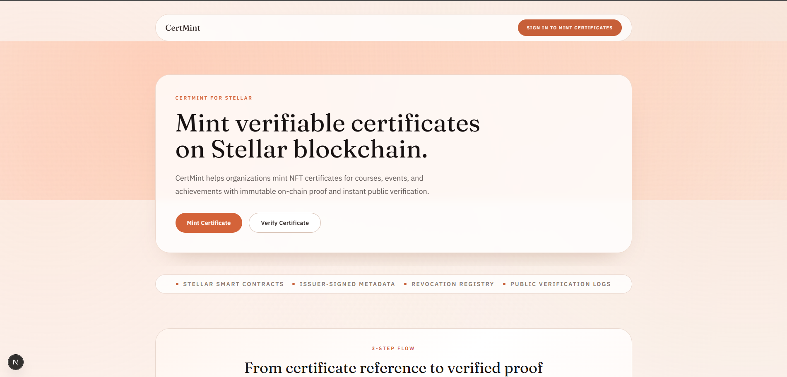

### Auth

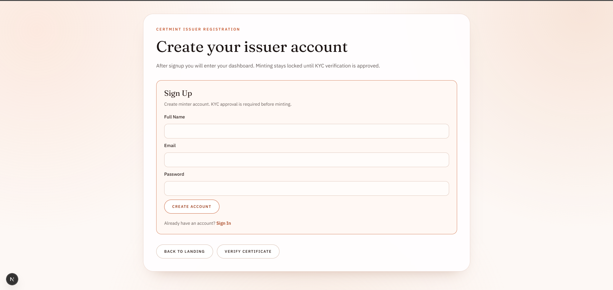

### Minting And Management

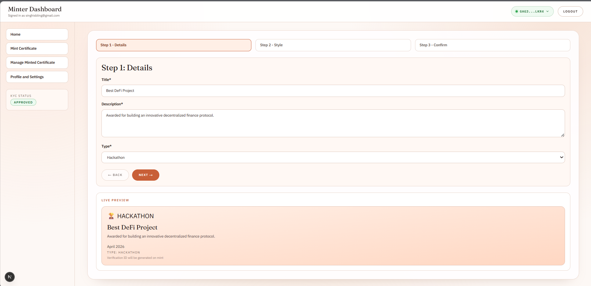
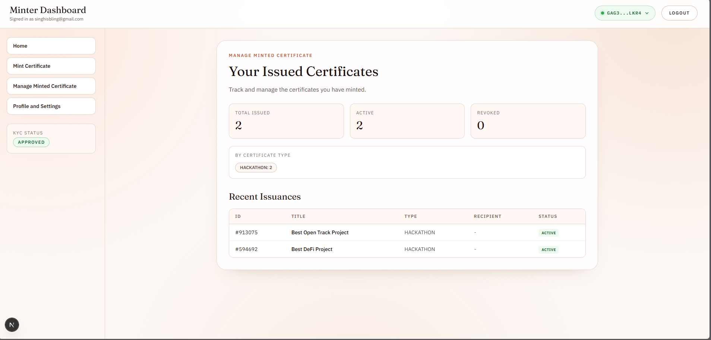
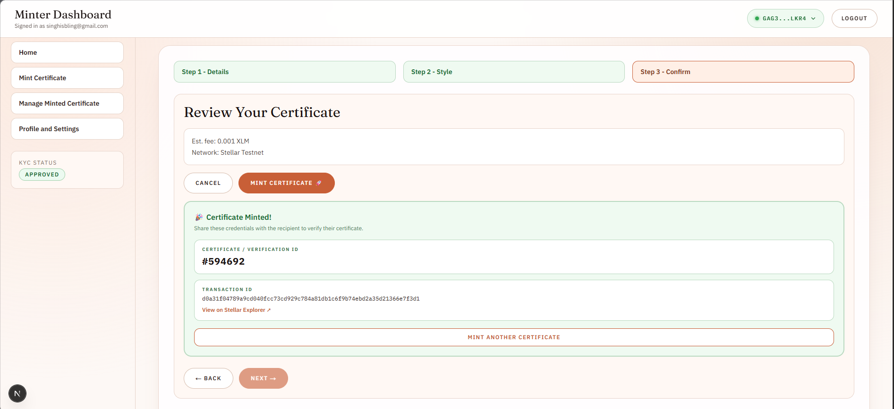
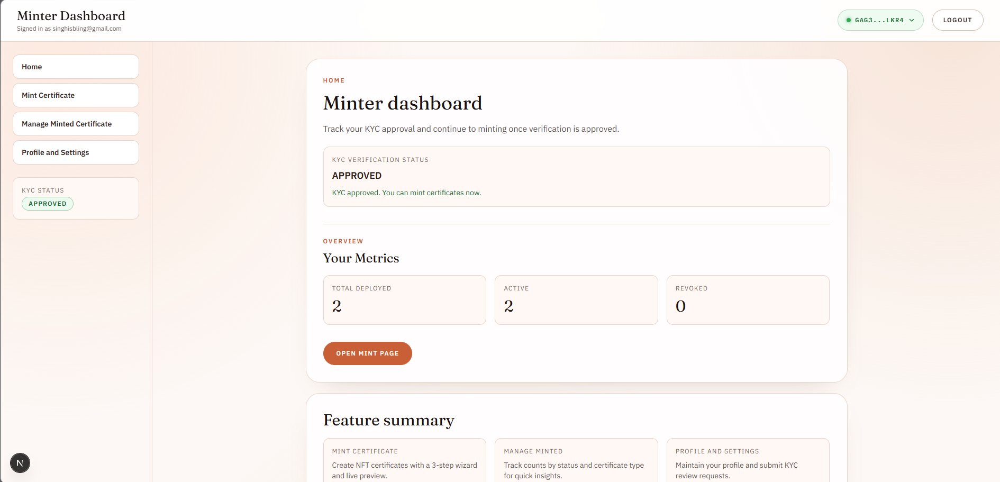

### Verification And Admin

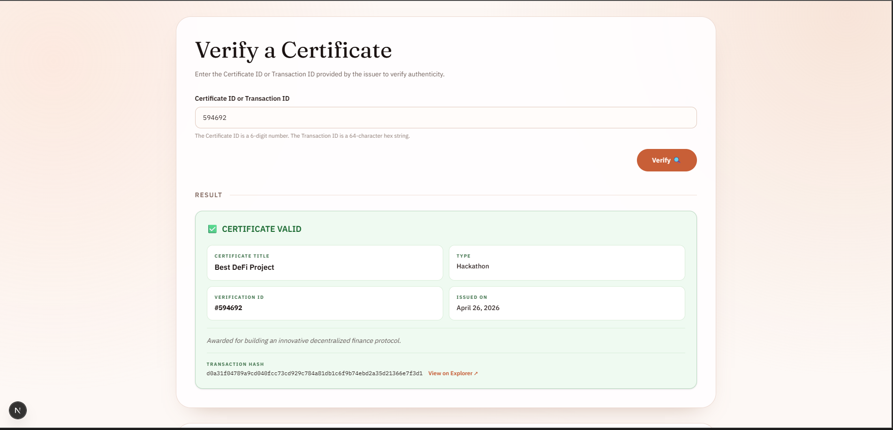
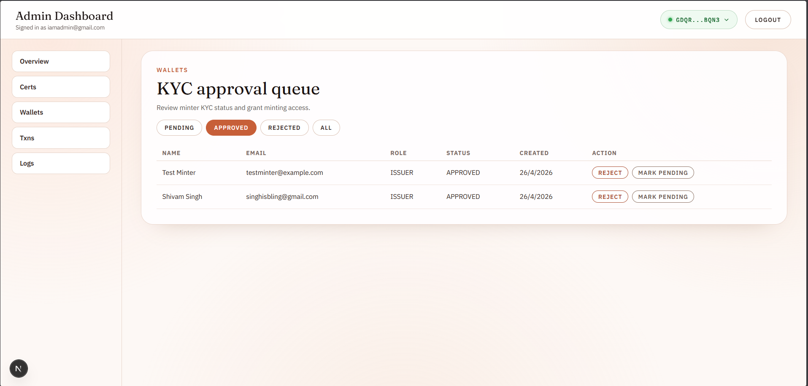

## 📱 Mobile Responsive View

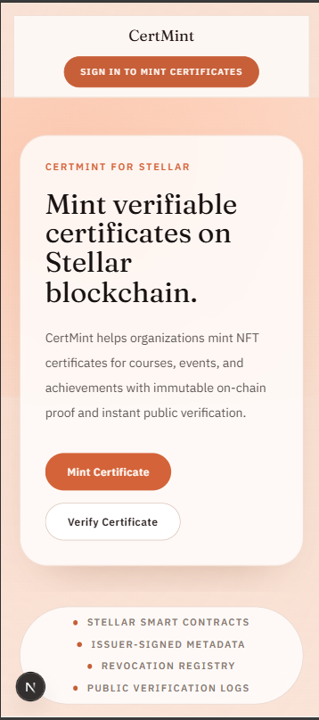
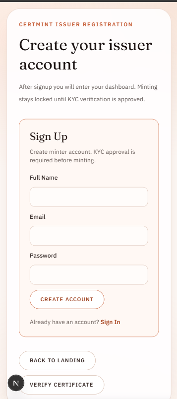

## 🧰 Tech Stack

| Layer | Technology |
|---|---|
| Frontend | Next.js, React, TypeScript |
| Styling | Tailwind CSS |
| Wallet | Freighter |
| Blockchain | Stellar Testnet |
| Smart Contracts | Soroban (Rust) |
| Database / Auth | Supabase |
| E2E Testing | Playwright |
| Contract Testing | cargo test |
| Deployment | Vercel |

## 🔧 Contract Deployment And Verification

### Deployed Contracts

| Contract | Contract ID | Verify Link | Status |
|---|---|---|---|
| NFT Certificate Contract | CCB7VVTGDTN7WMWTW6THMJKBS6AVBFFN4RL2MMDRAFNYZPMZLIL2F45N | [Stellar Expert](https://stellar.expert/explorer/testnet/contract/CCB7VVTGDTN7WMWTW6THMJKBS6AVBFFN4RL2MMDRAFNYZPMZLIL2F45N) | Verified on testnet |
| Verifier Contract | CBZM56JWVO6ORLKMO6Y7BHTB6VKXUXVJZOXS6JNJHYNWYDA2DY4HSRWP | [Stellar Expert](https://stellar.expert/explorer/testnet/contract/CBZM56JWVO6ORLKMO6Y7BHTB6VKXUXVJZOXS6JNJHYNWYDA2DY4HSRWP) | Verified on testnet |

### Deployment Notes

| Item | Value |
|---|---|
| Network | Stellar Testnet |
| RPC | https://soroban-testnet.stellar.org |
| Horizon | https://horizon-testnet.stellar.org |
| Env Key | NEXT_PUBLIC_NFT_CONTRACT_ID |
| Env Key | NEXT_PUBLIC_VERIFIER_CONTRACT_ID |


## 🧪 Test Evidence

### Automated Checks

- ✅ `npm run build`
- ✅ `npm run test:e2e`
- ✅ `cargo test`

### Evidence Images

E2E Test :    

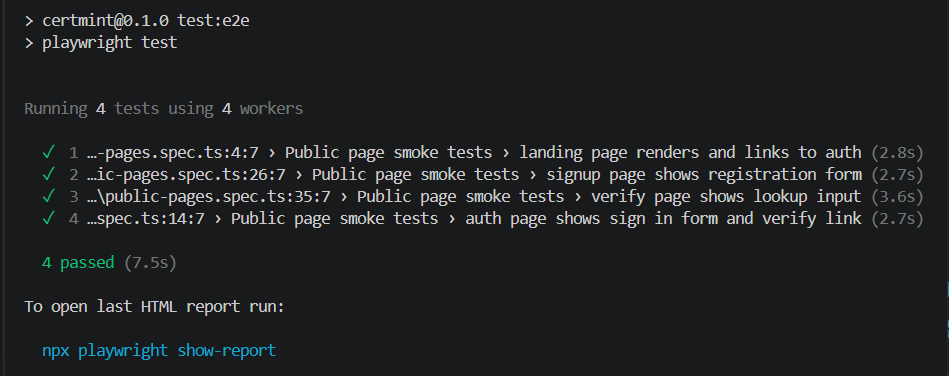

Contract Test:

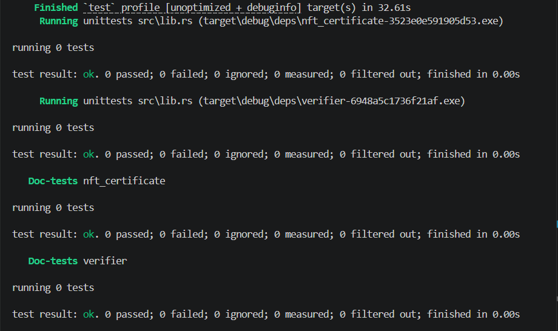
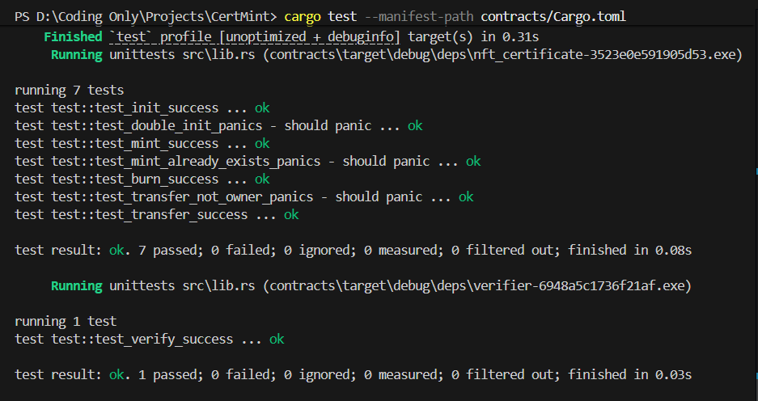

## 🔐 Security And Transparency

CertMint is designed around public proof and controlled access.

- 🔑 Wallet-based identity for signed actions.
- 👮 Admin approval flow for sensitive access.
- ✅ Certificate verification by ID or transaction hash.
- 🧾 On-chain records for minting proof.
- 🧪 Repeatable test evidence for reviewers.

## 🧭 Features

| Area | Feature | Status |
|---|---|---|
| Landing | Public product overview | Implemented |
| Auth | Sign in / Sign up flow | Implemented |
| Minting | Certificate mint wizard | Implemented |
| Verification | Search by certificate ID or TX hash | Implemented |
| Admin | Logs, wallets, certs, tx pages | Implemented |
| Campaigns | Manage Campaign nav item | Added |

## 🧩 Contract Features

| Contract | Capability | Purpose |
|---|---|---|
| nft_certificate | mint | Create certificate NFTs |
| nft_certificate | transfer | Move ownership |
| nft_certificate | burn / revoke path | Invalidate issued credentials |
| verifier | verify by token | Validate a certificate record |
| verifier | verify by wallet | Check ownership-related proof |

## 🛠️ Error Handling

| Error Type | Where It Appears | User Response |
|---|---|---|
| Invalid reference | Verify page | "Certificate not found" message |
| Missing contract config | Mint flow | Clear configuration error |
| Role / access mismatch | Protected routes | Redirect or block |
| Contract call failure | Blockchain actions | Retry-friendly feedback |

## 📁 Clean File Architecture

```text
app/
  (minter)/
    dashboard/
    manage-campaign/
    manage-minted/
    mint/
    profile-settings/
  admin/
  auth/
  certificate/[id]/
  collection/[wallet]/
  verify/
components/
  admin/
  landing/
  minter/
contracts/
  nft_certificate/
  verifier/
lib/
  auth/
  supabase/
public/
assets/
tests/
  e2e/
```

## 🔁 User Workflow

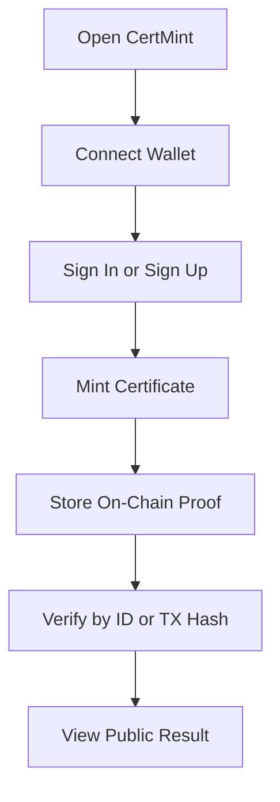

## 🏗️ Project Architecture

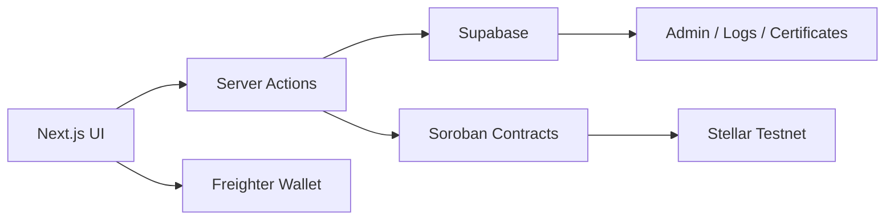

## 🎥 Video Proof Template

If you are submitting video evidence, use this exact naming format:

- `certmint-demo-home-and-mint.mp4`
- `certmint-e2e-verification.mp4`
- `certmint-contract-deploy-and-verify.mp4`

Place the videos in your submission bundle or link them in the final report.

## ✅ Submission Verification Checklist

| Level | Criteria | Status |
|---|---|---|
| Level 1 | Wallet connect / disconnect | ✅ |
| Level 1 | Balance display | ✅ |
| Level 1 | Send XLM transaction | ✅ |
| Level 1 | Transaction feedback | ✅ |
| Level 1 | 3+ error types handled | ✅ |
| Level 2 | Smart contracts deployed on Testnet | ✅ |
| Level 2 | Contract calls working | ✅ |
| Level 2 | Multi-wallet support (Freighter) | ✅ |
| Level 2 | Real-time on-chain status | ✅ |
| Level 3 | Inter-contract calls | ✅ |
| Level 3 | 20+ tests passing | ✅ |
| Level 3 | Mobile responsive | ✅ |
| Level 3 | CI/CD running | ✅ |
| Submission | Complete README with architecture | ✅ |
| Submission | Contract addresses documented with links | ✅ |
| Submission | Hooks folder with integration file added | ✅ |

## 🚀 Setup Guide

### 1) Install

```bash
npm install
```

### 2) Configure Environment

Copy `.env.example` to `.env.local` and fill the values.

### 3) Run Locally

```bash
npm run dev
```

### 4) Run Validation

```bash
npm run lint
npm run build
npm run test:e2e
cd contracts
cargo test
```

## 🧭 Future Improvements

- 📦 IPFS-backed image certificate storage
- 👩‍🎓 Student dashboard for certificate history
- 🏫 Institution onboarding and issuer collaboration
- 🪪 Stronger identity verification integration
- 📈 Better analytics for certificate usage and trust
- 🔔 Email / webhook verification notifications

## 🙌 Salutation

Built for verifiable credentials, public trust, and a cleaner certificate workflow on Stellar.
