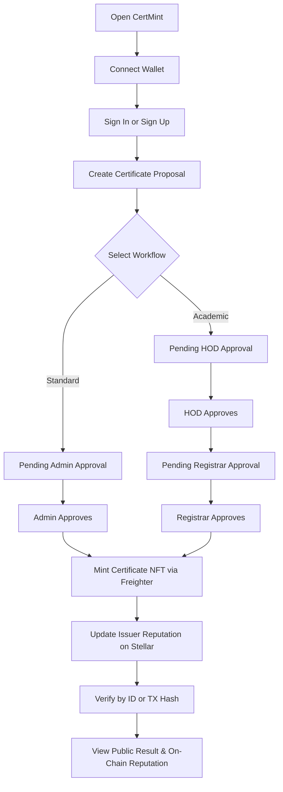
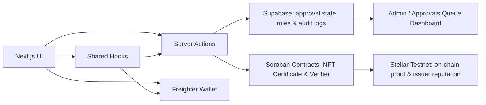

<p align="center">
  
</p>

<h1 align="center">CertMint</h1>

<p align="center">
  🎓 Web3 certificate minting and verification on Stellar.
</p>

<p align="center">
  
  
  
  
  
</p>

<p align="center">
  <strong>Live Production:</strong> <a href="https://cert-mint.vercel.app" target="_blank">https://cert-mint.vercel.app</a>
</p>

<p align="center">
  <strong>Youtube Demo Video :</strong> <a href="https://youtu.be/m4fN9fJSC18" target="_blank">https://youtu.be/m4fN9fJSC18</a>
</p>

## ✨ About The Project

CertMint is a certificate minting platform built on the Stellar network. It lets organizations mint, verify, and manage NFT-backed certificates with public proof, transaction history, and a clean reviewer-friendly audit trail.

The project is focused on real certificate workflows, not generic task farming. The value is in proof, transparency, and verification.

## 🔒 Why It Matters

- 🧾 Certificates are verifiable from IDs or transaction hashes.
- 🛰️ Stellar testnet transaction history provides public proof.
- 🛡️ Verification pages reduce fake credential risk.
- 📊 Admin views help track minting, logs, wallets, and system status.
- 📱 The app is responsive for desktop and mobile review.

## 🖼️ Screenshots

### Landing


### Auth


### Minting And Management


### Verification And Admin


## 📱 Mobile Responsive View


## 🧰 Tech Stack

| Layer | Technology |
|---|---|
| Frontend | Next.js, React, TypeScript |
| Styling | Tailwind CSS |
| Wallet | Freighter |
| Blockchain | Stellar Testnet |
| Smart Contracts | Soroban (Rust) |
| Database / Auth | Supabase |
| E2E Testing | Playwright |
| Contract Testing | cargo test |
| Deployment | Vercel |

## 🔧 Contract Deployment And Verification

### Deployed Contracts

| Contract | Contract ID | Verify Link | Status |
|---|---|---|---|
| NFT Certificate Contract | CCC732QGOBVC2MJEBHIS4RU57IGHJSWHBL6BHD2AXNUCNYBWA3PNL4WO | [Stellar Expert](https://stellar.expert/explorer/testnet/contract/CCC732QGOBVC2MJEBHIS4RU57IGHJSWHBL6BHD2AXNUCNYBWA3PNL4WO) | Verified on testnet |
| Verifier Contract | CBUVPMCNQ33YITCLGQGPRXAMS3C3BYCBLREEXRIFVRJ5LUYJXJTM4NGA | [Stellar Expert](https://stellar.expert/explorer/testnet/contract/CBUVPMCNQ33YITCLGQGPRXAMS3C3BYCBLREEXRIFVRJ5LUYJXJTM4NGA) | Verified on testnet |

### Deployment Notes

| Item | Value |
|---|---|
| Network | Stellar Testnet |
| RPC | https://soroban-testnet.stellar.org |
| Horizon | https://horizon-testnet.stellar.org |
| Env Key | NEXT_PUBLIC_NFT_CONTRACT_ID |
| Env Key | NEXT_PUBLIC_VERIFIER_CONTRACT_ID |
| Env Key | NEXT_PUBLIC_SOROBAN_RPC_URL |

### Manual Contract Deployment

The repository does not currently automate on-chain deployment in CI. Use the Soroban CLI and a funded deploy account to publish contracts after building artifacts.

```powershell
npm run build:contracts
pwsh ./scripts/deploy-contracts.ps1 -Network testnet -Deploy
```

If you do not want to deploy immediately, build artifacts only with:

```powershell
npm run build:contracts
```

## 🆕 New Smart Contract Feature

- ✅ On-chain issuer reputation tracking for every issued certificate.
- ✅ Endorsement support: certificates can receive on-chain endorsements and endorsement history can be queried.
- ✅ Verifier contract performs cross-contract validation by querying the NFT contract directly.

## 🧪 Test Evidence

### Automated Checks

- ✅ `npm run build`
- ✅ `npm run test:e2e`
- ✅ `cargo test`

### Evidence Images

E2E Test :    


Contract Test:


## 🔐 Security And Transparency

CertMint is designed around public proof and controlled access.

- 🔑 Wallet-based identity for signed actions.
- 👮 Admin approval flow for sensitive access.
- ✅ Certificate verification by ID or transaction hash.
- 🧾 On-chain records for minting proof.
- 🧪 Repeatable test evidence for reviewers.

## 🧭 Features

| Area | Feature | Status |
|---|---|---|
| Landing | Public product overview | Implemented |
| Auth | Sign in / Sign up flow | Implemented |
| Minting | Certificate mint wizard | Implemented |
| Approvals | Multi-Level Workflows (Standard: Faculty/Issuer → Admin → Mint; Academic: Faculty → HOD → Registrar → Mint) | Implemented |
| Endorsements | On-chain endorsements for issued certificates | Implemented |
| Reputation | Issuer Reputation System (Total Issued, Revoked Count, Reputation Score tracked on-chain) | Implemented |
| Hooks | Shared wallet and mint integration logic | Added |
| Verification | Search by certificate ID or TX hash | Implemented |
| Admin | Logs, wallets, certs, tx pages | Implemented |
| Campaigns | Manage Campaign nav item | Added |

## 🧩 Contract Features

| Contract | Capability | Purpose |
|---|---|---|
| nft_certificate | mint | Create certificate NFTs & increments issuer reputation score |
| nft_certificate | transfer | Move ownership |
| nft_certificate | burn / revoke path | Invalidate issued credentials & decrements issuer reputation score |
| nft_certificate | get_issuer | Query issuer reputation data (total issued, revoked, reputation score) |
| nft_certificate | endorse_certificate | Add on-chain endorsements to a certificate |
| nft_certificate | get_endorsements | Query certificate endorsement history |
| verifier | verify by token | Validate a certificate record |
| verifier | verify by wallet | Check ownership-related proof |

## 🛠️ Error Handling

| Error Type | Where It Appears | User Response |
|---|---|---|
| Invalid reference | Verify page | "Certificate not found" message |
| Missing contract config | Mint flow | Clear configuration error |
| Role / access mismatch | Protected routes | Redirect or block |
| Contract call failure | Blockchain actions | Retry-friendly feedback |

## 📁 Clean File Architecture

```text
app/
  (minter)/
    dashboard/
    manage-campaign/
    manage-minted/
    mint/
    profile-settings/
  admin/
  auth/
  certificate/[id]/
  collection/[wallet]/
hooks/
  use-integration.ts
  verify/
components/
  admin/
  landing/
  minter/
contracts/
  nft_certificate/
  verifier/
lib/
  auth/
  supabase/
public/
assets/
tests/
  e2e/
```

## 🔁 User Workflow



## 🏗️ Project Architecture



## 🚀 Setup Guide

### 1) Install

```bash
npm install
```

### 2) Configure Environment

Copy `.env.example` to `.env.local` and fill the values.

### 3) Run Locally

```bash
npm run dev
```

### 4) Run Validation

```bash
npm run lint
npm run build
npm run test:e2e
cd contracts
cargo test --all
cargo build --release --target wasm32v1-none
```

### 5) Run with Docker (Recommended)

Ensure you have **Docker** and **Docker Compose** installed, then follow these steps:

1. **Configure environment variables** inside your `.env` file (copied from `.env.example`).
2. **Build and start the container** using Docker Compose:
   ```bash
   docker compose up --build -d
   ```
   *Note: Next.js public environment variables (`NEXT_PUBLIC_*`) are read from `.env` and baked in at build time.*
3. **Access the application** at `http://localhost:3000`.
4. **Stop the container**:
   ```bash
   docker compose down
   ```

## 🧭 Future Improvements

- 📦 IPFS-backed image certificate storage
- 👩‍🎓 Student dashboard for certificate history
- 🏫 Institution onboarding and issuer collaboration
- 🪪 Stronger identity verification integration
- 📈 Better analytics for certificate usage and trust
- 🔔 Email / webhook verification notifications

## 🙌 Salutation

Love doing this amazing project on stellar ecosystem! ❤️
Built for verifiable credentials, public trust, and a cleaner certificate workflow on Stellar.
